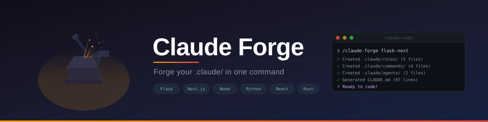

<p align="center">
  
</p>

<p align="center">
  <a href="./LICENSE"></a>
  
  
  
</p>

<p align="center">
  <strong>One command to scaffold the complete <code>.claude/</code> directory for Claude Code.</strong><br>
  Templates, rules, commands, agents, hooks, and stack-specific presets.<br>
  Stop rebuilding — start building.
</p>

<p align="center">
  🇧🇷 <a href="./README.pt-br.md">Leia em Português</a>
</p>

---

## ⚡ Quick Start

```bash
# Install once (global skill)
git clone https://github.com/brunobracaioli/claude-forge.git ~/.claude/skills/claude-forge

# Use in any project
cd your-project
```

Then inside Claude Code:

```
/claude-forge flask-next
```

Or just ask naturally:

> *"Set up the .claude directory for this project"*

---

## 🎯 What You Get

A single command creates **15+ files** across 6 categories:

| | Component | What's Inside |
|---|---|---|
| 📄 | **CLAUDE.md** | Stack-specific template with `[CUSTOMIZE]` markers, under 200 lines |
| 📏 | **Rules** (4+) | `code-style` · `testing` · `security` · `git-workflow` + stack-specific |
| ⚡ | **Commands** (4) | `/review` · `/fix-issue` · `/spec` · `/commit` |
| 🤖 | **Agents** (2) | `code-reviewer` · `security-auditor` — isolated subagents |
| 🔒 | **Hooks** (2) | `validate-bash` blocks destructive commands · `auto-format` runs your formatter |
| ⚙️ | **Settings** | Sensible permissions with hook wiring out-of-the-box |

---

## 🏗️ Supported Stacks

Auto-detection scans your project files and picks the right preset:

| Stack | Detected By | Extra Rules |
|:---|:---|:---|
| **flask-next** | `requirements.txt` + `next.config.*` | API conventions, Flask patterns |
| **node** | `package.json` | Node/TypeScript conventions |
| **python** | `requirements.txt` / `pyproject.toml` | Python conventions, type hints |
| **react** | `next.config.*` (no Python files) | React/Next.js conventions, a11y |
| **rust** | `Cargo.toml` | Rust conventions, error handling |
| **generic** | *(fallback)* | Base rules only |

> **Adding a stack is a PR away.** Django, Go, Java/Spring, PHP/Laravel, .NET — [contributions welcome](#-contributing).

---

## 📦 Installation

Choose one:

### Git Clone *(recommended)*

```bash
git clone https://github.com/brunobracaioli/claude-forge.git ~/.claude/skills/claude-forge
chmod +x ~/.claude/skills/claude-forge/scripts/bootstrap.sh
```

### One-liner

```bash
curl -fsSL https://raw.githubusercontent.com/brunobracaioli/claude-forge/main/install.sh | bash
```

### Claude Code Plugin

```
/plugins install claude-forge
```

---

## 📂 Generated Structure

```
your-project/
├── CLAUDE.md                          ← Team instructions (< 200 lines)
└── .claude/
    ├── settings.json                  ← Permissions + hooks
    ├── .gitignore                     ← Ignores personal files
    │
    ├── rules/                         ← Modular instructions
    │   ├── code-style.md
    │   ├── testing.md
    │   ├── security.md
    │   ├── git-workflow.md
    │   └── <stack>-conventions.md     ← Stack-specific rules
    │
    ├── commands/                      ← Manual slash commands
    │   ├── review.md                  ← /project:review
    │   ├── fix-issue.md               ← /project:fix-issue <n>
    │   ├── spec.md                    ← /project:spec <feature>
    │   └── commit.md                  ← /project:commit
    │
    ├── agents/                        ← Isolated subagents
    │   ├── code-reviewer.md
    │   └── security-auditor.md
    │
    ├── skills/
    │   └── example-skill/SKILL.md     ← Template for your own skills
    │
    └── hooks/                         ← Event-driven automation
        ├── validate-bash.sh           ← Blocks rm -rf, secret exposure
        └── auto-format.sh             ← Auto-format after edits
```

---

## 🎨 Customization

All generated files with `[CUSTOMIZE]` markers need project-specific adjustments.

**Edit in this order** — highest impact first:

| Priority | File | Why |
|:---:|:---|:---|
| 1 | `CLAUDE.md` | Claude reads this every session. Get it right. |
| 2 | `.claude/settings.json` | Adjust allow/deny for your build tools. |
| 3 | `.claude/rules/` | Delete what doesn't apply, add what's missing. |
| 4 | `.claude/hooks/auto-format.sh` | Uncomment the formatter for your stack. |
| 5 | `.claude/commands/` | Add project-specific workflows. |
| 6 | `.claude/agents/` `.claude/skills/` | Add as complexity grows. |

<details>
<summary><strong>Adding a new command</strong></summary>

```bash
cat > .claude/commands/deploy.md << 'EOF'
---
description: Deploy to staging or production
argument-hint: [staging|production]
---
Deploy to $ARGUMENTS environment...
EOF
```

This creates `/project:deploy` automatically.

</details>

<details>
<summary><strong>Adding a new skill</strong></summary>

```bash
mkdir -p .claude/skills/my-skill
cp .claude/skills/example-skill/SKILL.md .claude/skills/my-skill/SKILL.md
# Edit SKILL.md with your instructions
```

Skills auto-invoke based on the `description` field in frontmatter.

</details>

<details>
<summary><strong>Adding a new agent</strong></summary>

```bash
cat > .claude/agents/db-explorer.md << 'EOF'
---
name: db-explorer
description: Explore database schema and data
model: haiku
tools: Read, Bash(psql *)
---
You are a database expert...
EOF
```

Agents run in isolated context windows — they won't pollute your main session.

</details>

---

## 🧠 Design Principles

These templates follow [official Anthropic best practices](https://code.claude.com/docs/en/best-practices):

| Principle | Why |
|:---|:---|
| **CLAUDE.md under 200 lines** | Longer files degrade instruction adherence. Overflow goes to `rules/`. |
| **Progressive disclosure** | `@references` load on demand — don't dump everything into context. |
| **Deterministic safety** | Hooks block dangerous commands 100% of the time. CLAUDE.md is ~70%. |
| **Git-friendly** | Team files committed. Personal files (`.local.md`, `.local.json`) gitignored. |
| **Non-destructive** | Never overwrites existing files. Safe to re-run on any project. |
| **~150 instruction budget** | Claude Code's system prompt uses ~50 instructions. Your config shares the rest. |

---

## 🤝 Contributing

Contributions welcome! Some ideas:

| Category | Examples |
|:---|:---|
| **New stacks** | Django, Go, Java/Spring, PHP/Laravel, .NET |
| **New commands** | deploy, changelog, migration, docs-update |
| **New agents** | performance-profiler, accessibility-auditor, api-designer |
| **Translations** | Help translate templates to other languages |

See [CONTRIBUTING.md](./docs/CONTRIBUTING.md) for guidelines.

---

## 📚 References

- [Best Practices — Claude Code Docs](https://code.claude.com/docs/en/best-practices)
- [Using CLAUDE.md Files — Anthropic Blog](https://claude.com/blog/using-claude-md-files)
- [Skills Documentation](https://code.claude.com/docs/en/skills)
- [Agent Skills Overview](https://platform.claude.com/docs/en/agents-and-tools/agent-skills/overview)

---

<p align="center">
  <sub>Built with ⚡ by <a href="https://github.com/brunobracaioli">@brunobracaioli</a></sub><br>
  <sub>MIT License</sub>
</p>